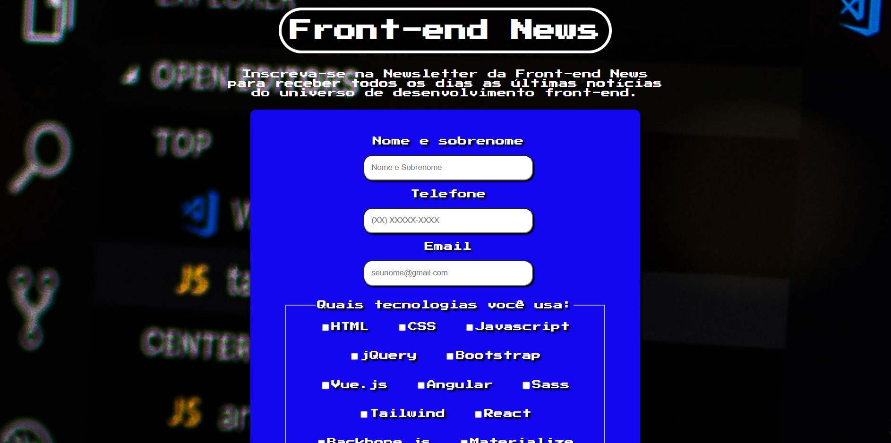

# Front-end News

## Deploy do projeto

<link em breve...>

Este é um projeto de uma página de inscrição na Newsletter de um site de notícias fictício chamado "Front-end News", usando HTML, CSS e Javascript.

## Tabela de Conteúdos

- [Meu Processo de Desenvolvimento](#meu-processo-de-desenvolvimento)
- [Autor do Projeto](#autor-do-projeto)

## Meu processo de Desenvolvimento
Assim que acessamos o site, percebe-se o efeito de "máquina de escrever" ou "typewriter" no título e na descrição, pra isso foi usado o Javascript. Após inserida as informações, ao clicar no botão "Inscrever-se", o usuário é levado à página de confirmação de inscrição com a mensagem "inscrição feita com sucesso! obrigado!" ao lado do botão "voltar", que retorna à página inicial.

## Autor do Projeto

- GitHub - [Gabriel-L-Santos](https://github.com/Gabriel-L-Santos)
- LinkedIn - [Gabriel Leme dos Santos](https://www.linkedin.com/in/gabriel-leme-dos-santos/)